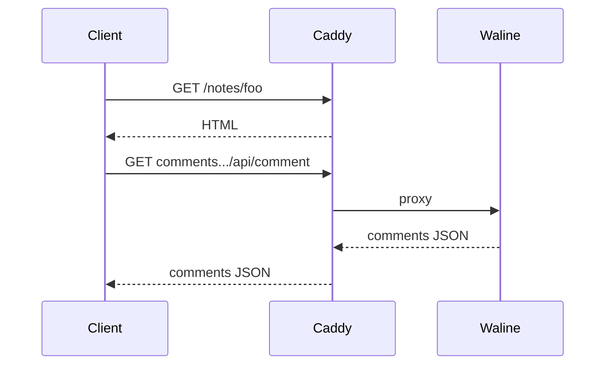

This note exists to exercise every feature the notes section supports.
See [first steps](/notes/first-steps/) for an introduction to the site.

## Math

Inline like $E = mc^2$ and display:

$$
\int_0^\infty e^{-x^2}\, dx = \frac{\sqrt{\pi}}{2}
$$

## Code

```python
def greet(name: str) -> str:
    return f"hello, {name}"
```

## Quotes

> Programs must be written for people to read, and only incidentally for
> machines to execute.
> — Hal Abelson

## Figures with captions

The alt text below becomes a `<figcaption>` automatically.


Click the image to open it in a lightbox.

## Diagrams as code



## Backlinks

This note links to [first steps](/notes/first-steps/), so that note's
page will list this one under "Mentioned in".

## More headings to trigger the table of contents

The TOC only appears with ≥ 3 h2/h3 headings.

### A subheading

The TOC nests h3 entries under h2 entries with a slight indent.

### Another subheading

Hover any heading on this page to reveal the `#` anchor link.
